# WaveSend: "Money moves offline, with just a text."

## Overview

Wave send (Contract WaveSend.sol) is a revolutionary digital wallet that enables blockchain transactions via SMS, making it ideal for areas with unreliable infrastructure, crisis situations, and disasters. Our solution ensures financial access even when the internet is unavailable. Developed on the Scroll network, the project offers a transparent, efficient, and automated platform for those who need to perform offline transactions.

## Tech Chart

```mermaid
flowchart TD
 subgraph subGraph0["📱 WaveSend App"]
        Frontend["🖌 Frontend React"]
        User[("👤 User")]
        SMS["📨 SMS"]
        Twilio["🔧 Twilio API"]
        Backend["🔧 Backend Node.js"]
        Blockchain["Blockchain"]
  end
    User -- &nbsp;&nbsp;Access&nbsp;&nbsp; --> Frontend
    Frontend -- &nbsp;&nbsp;Sign txn&nbsp;&nbsp; --> SMS
    SMS -- &nbsp;&nbsp;Send signed Txn&nbsp;&nbsp; --> Twilio
    Twilio -- &nbsp;&nbsp;Webhook&nbsp;&nbsp; --> Backend
    Backend -- &nbsp;&nbsp;Callback&nbsp;&nbsp; --> Twilio
    Backend -- &nbsp;&nbsp;Delivers to&nbsp;&nbsp; --> Blockchain
    Blockchain -- &nbsp;&nbsp;Get Data&nbsp;&nbsp; --> Backend
    Twilio -- &nbsp;&nbsp;Return Txn Data&nbsp;&nbsp; --> SMS

    Blockchain@{ shape: cyl}
    style Frontend fill:#ebdef0,stroke:#8e44ad,stroke-width:2px
    style User fill:#f9f9f9,stroke:#333,stroke-width:2px
    style SMS fill:#3498db,stroke:#2980b9,stroke-width:2px
    style Twilio fill:#e74c3c,stroke:#c0392b,stroke-width:2px
    style Backend fill:#d5f5e3,stroke:#1abc9c,stroke-width:2px
    style Blockchain fill:#f9f9f9,stroke:#333,stroke-width:2px
    style subGraph0 fill: white


%%{init:{'theme':'default'}}%%

```

## Main Features

### For Consumers
- *Keep Connection*: Consumers in regions with intermittent or no internet can still send and receive money using basic mobile phones.
- *Beyond Disasters*: In natural disasters or crises, when data networks fail, users maintain access to financial services via SMS, ensuring they can manage funds in critical times.
- *General Inclusion*: Reaches 1.7 billion people with limited internet access but basic phone ownership, offering them a gateway to financial services.
- *Low tech Acessibility*: No need for smartphones or stable data—just a simple phone with SMS capability, making it affordable and widely usable.
- *High Efficiency*: The compact base188 encoding reduces SMS size and cost, making transactions affordable even in low-income regions.
- *Transparency*: Receiving transaction IDs and nonces via SMS provides clear confirmation, giving users confidence in the process.

### Payment services
- *Global Impact*: Expands the reach of digital payments to underserved areas, leveraging the 98% global SMS availability.
- *Whole Enhancement*: Enhances the resilience of the payment ecosystem by functioning independently of internet connectivity.
- *Financial Inclusion*: Promotes financial inclusion, broadening the user base without requiring advanced technology.
- *Barriedless*: Reduces dependency on expensive hardware or data plans, lowering barriers to entry for digital transactions.
- *Overall Security*: Optimizes transaction processing, keeping operational costs low while maintaining blockchain security.
- *Trustfull System*: Builds trust in the system by ensuring users can verify completed transactions easily.

## Technologies Used

- *Solidity*: Programming language for smart contracts.
- *Base188 Encoding*: A custom, optimized encoding system that compresses transaction data into a compact format suitable for SMS transmission (typically limited to 160 characters).
- *Scroll Network*: It offers scalability, low cost, and high transaction speed.
- *Twilio*: Webhook (SMS API) - A webhook is the automated system that triggers the sending of the message.
- *NextJS*: Applied nn the webapp.

## Smart Contract Featureo

### Transaction Process 
- initiateTransaction: Verifies the signature and queues the transaction for processing via SMS relay.
- processTransaction: Decodes the data, validates it, and updates the blockchain state (e.g., transferring funds).

### Security Verification
- verifySignature: Ensures the transaction’s authenticity before execution, using standard Ethereum signature verification (e.g., ecrecover).

### Funds Management
- withdrawFunds: Transfers the specified amount to the caller after validation.

### Transaction Details
- getTransactionStatus: Queries the blockchain for transaction details, such as whether it’s pending, completed, or failed.

### Security Enhancement
- setRelayAddress: Restricts transaction processing to an authorized relay, enhancing security.

## Advantages of the Scroll Network

- **Ethereum Compatibility**: Simplifies connection with the Ethereum network.
- **High Speed**: Quick transaction validations.
- **Scalability**: Handles a high number of transactions.
- **Low Cost**: Lowered transaction expenses.

## Development Roadmap

### Phase 1: Deploy
- Full deployment on Scroll Sepolia
- Support for ERC-20 tokens

### Phase 2: Expansion
- Expansion to additional blockchain networks
- Support for NFTs

### Phase 3: Partnership
- Partnerships with humanitarian organizations for implementation in crisis areas.

### Phase 4: LoRa Integration
- Implementation of LoRa technology for long-range communication
- Development of LoRa-compatible hardware for areas without cellular coverage
- Hybrid SMS/LoRa communication protocols for maximum resilience
- Field testing in remote regions with limited infrastructure

## Deploy WaveSend
Copy enviroment sample 

cp env.sample .env

Edit environment variable following these tips
bash
NEXT_PUBLIC_PVK_DEPLOYER=[ETH private key]
TWILLIO_TOKEN=Basic [encoded base64 user:secret]
TWILLIO_ACCOUNT=[twillio account id]
NEXT_PUBLIC_TWILLIO_NUMBER=[twillio number formatted]

Install dependecies
bash
yarn install

Build Application
bash
yarn build

Test locally the app
bash
yarn dev

Build your image
bash
docker build . -f ./Dockerfile -t yourregistry/wavesend:latest

Upload to your registry
bash
docker push yourregistry/wavesend:latest

* Deploy app in a cloud and point a DNS to it 
* Configure Twillio webhook to call /api/relay
  
## How to Contribute

1. Fork the repository
2. Create a branch for your feature. (git checkout -b feature/NewFunction)
3. Commit your changes (git commit -m 'Add New Function')
4. Push to the branch (git push origin feature/NewFunction)
5. Open a Pull Request

## Contact

Project Link: [https://github.com/juancolchete/waveSend](https://github.com/juancolchete/waveSend)

## Licence

This project is licensed under the MIT License.
